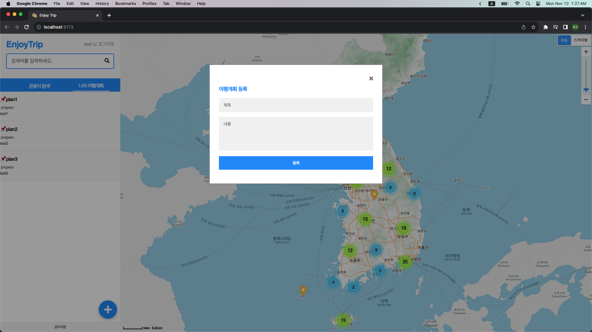

# Vue.js 프로젝트 

## 프로젝트 내용
(이전) <a href="https://lab.ssafy.com/s10/a19/09_springboot/pair06_leedongjae_parkjongwoo">이동재, 박종우 스프링 프로젝트</a>의 HTML과 Vanilla Javascript로 구현한 프론트엔드에 Vue.js 프레임워크를 적용
1. 한 html 작성된 DOM을 기능/부분 별로 Vue Component 형태로 분할
2. document.getElementById로 적용한 Javascript를 Vue.js Composition내 script 태그 안으로 이동
3. fetch로 구현한 Ajax 대신 Axios 활용

## 프로젝트 동작 화면
### 메인 화면


### 메인 화면 로그인 상태
로그인 상태를 확인하여 여행계획 보기 및 작성 요소 제공


### 로그인상태 여행계획 리스트


### 여행 계획 추가 모달


### 시도/구군 선택 검색 API 연동


## 구현 내용

### Component 구조


### 1. Vue Compoenent로 변경
#### Sidebar.vue
```javascript
<script setup>
// import '@/assets/js/header.js'
import LoginView from "@/views/LoginView.vue";
import SearchBoxView from "@/views/SearchBoxView.vue";
import TripPlanTabView from "@/views/TripPlanTabView.vue";
import PlanRegistView from "@/views/PlanRegistView.vue";
</script>

<template>
  <div>
    <div class="IE6MIN">
      <div id="header" class="Header" role="banner">
        <div>
          <div class="Title">
            <a href="">EnjoyTrip</a>
          </div>
          <div id="user">
            <!--로그인 여부-->
            <LoginView />
          </div>
        </div>
        <PlanRegistView />
        <SearchBoxView />
      </div>
    </div>
    <div class="Info">
      <TripPlanTabView />
      <footer class="Footer">
        <span>공지사항</span>
      </footer>
    </div>
    <div class="bar"></div>

    <main class="View">
      <div id="map" style="width: 100%; height: 100%"></div>
    </main>

  </div>
</template>

<style scoped></style>
```

### 2. 동적 javascript코드 Vue component내로 이동
document.getElementById로 DOM element를 직접 제어하는 대신 Vue에서 제공하는 ref로 화면을 동적으로 변경했습니다.

#### LoginView.vue
```javascript
<script setup>
import { ref, inject } from 'vue';

//... 생략

const loginId = ref('');
const loginPw = ref('');
const loginUser = () => {
    if (!loginId.value.trim() || !loginPw.value.trim()) {
        alert('빈칸이 없도록 입력해주세요.');
    } else {
        const body = {
            userid: loginId.value,
            userpassword: loginPw.value,
        };

        login(
            body,
            ({ data }) => {
                console.log(data);
                setCookie('id', body.userid);
                id.value = body.userid;
                closeLoginBtn();
            },
            (err) => {
                console.log(err);
            }
        );
    }
};
const logoutUser = () => {
    if (!id) {
        alert('로그인부터 해주세요.');
    } else {
        logout(
            ({ data }) => {
                console.log(data);
                id.value = '';
                deleteCookie('id');
            },
            (err) => {
                console.log(err);
            }
        );
    }
};
</script>
//... 생략

```

### 3. fetch로 구현한 Ajax 대신 Axios 활용
src/utils/http-commons.js 파일 내 글로벌하게 axios 객체를 생성하여 export해서 각자 vue component안에서 일괄적으로 호출하를 방식 적용.
``` javascript
import axios from "axios";

const localAxios = axios.create({
    baseURL: import.meta.env.VITE_API_BASE_URL,
    headers: {
        "Content-Type": "application/json;charset=utf-8"
    }
});

export { localAxios };
```

## 프로젝트 소감

<b>신우섭</b>

> 기존의 HTML, CSS, JavaScript 코드를 모두 Vue의 component로 분리해내는 과정에서 평소 코드를 잘 작성해 놓아야 이후에 편하다는 것을 느낄 수 있었습니다.
> 기존에 코드를 잘 분리해놓았기에 vue의 컴포넌트로 분리해내는 과정에서 별다른 어려움은 없었습니다.
> Vue 프레임워크를 사용하면서 편리하게 코드를 작성할 수 있었고 SPA에 대해 더 깊은 이해를 할 수 있었습니다.

<br>

<b>박종우</b>


> 기존 플레인 html css javascript를 vue.js 프레임워크 형태로 변환하는 과정에서 Vue.js에서 제공하는 다양한 편리한 기능을 체험할 수 있었습니다. 예를 들어 쿠키를 사용하여 로그인 상태를 확인하는 대신 vue에서 제공되는 provide, inject를 활용하여 다양한 component에서 로그인  여부에 따른 화면 표시를 할 수 있었습니다. 또한, 프론트엔드의 css적용 범위에 대한 공부를 하게 되었습니다. 컴포넌트 선언 위치에 따라  마지막으로 백엔드 서버와 통신 할때 다양한 컴포넌트 각자에서 fetch함수를 호출하는게 아니라 axios라이브러리를 활용해서 글로벌한 axios 오브젝트를 활용할 수 있게 했습니다.

<br>
